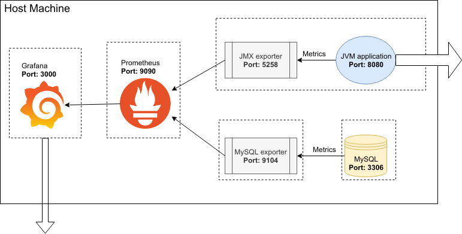

# Monitor JVM and MySQL using Grafana and Prometheus

Create a network: `docker network create test-network`

## Architecture Overview



## JVM

Create a dummy Java server (in case you don't have a Java running server yet) and use
[JMX exporter](https://github.com/prometheus/jmx_exporter) to generate metrics for Prometheus (Replace `SimpleServer` to your main server).

  Note that `SimpleServer` runs on port 8080.

  - Go to `jvm` folder.
  - `wget https://repo1.maven.org/maven2/io/prometheus/jmx/jmx_prometheus_javaagent/0.11.0/jmx_prometheus_javaagent-0.11.0.jar -O jmx_exporter.jar`
  - Edit `jmx-config.yaml`.
  - `docker build -t jmx-exporter .`
  - ```
    docker run -d  \
      -p 8080  \
      -p 5258  \
      --network test-network  \
      --name jmx-exporter \
      jmx-exporter
    ```


## MySQL

1. Create a dummy MySQL database (in case you don't have a MySQL database) and use [MySQL exporter](https://github.com/prometheus/mysqld_exporter) to generate metrics for Prometheus.

  ```
  docker run -d \
  --name mysql \
  -p 3306 \
  --network test-network \
  --env MYSQL_ROOT_PASSWORD=mypassword \
  --volume mysql-datadir:/var/lib/mysql \
  mysql:8 \
  --default-authentication-plugin=mysql_native_password

  ```

2. Create a specific user for the exporter.
  - `docker exec -it mysql mysql -uroot -p` and enter the password above
  - Run the below commands in the MySQL Shell:
    ```
      CREATE USER 'exporter'@'%' IDENTIFIED BY 'password' WITH MAX_USER_CONNECTIONS 3;
      GRANT PROCESS, REPLICATION CLIENT, SELECT ON *.* TO 'exporter'@'%';
    ```

3. Exit the running MySQL container and run MySQL exporter (Replace the password of `exporter` below).
  ```
  docker run -d \
  --name mysql-exporter \
  -p 9104 \
  --network test-network \
  --env DATA_SOURCE_NAME="exporter:password@(mysql:3306)/" \
  prom/mysqld-exporter \
  ```

## Prometheus
1. Go to the root folder of the project to create a Prometheus container.
  ```
    docker run -d \
      --name prometheus \
      -p 9090:9090  \
      --network test-network  \
      --restart unless-stopped  \
      --mount type=volume,src=prometheus-data,target=/prometheus \
      --mount type=bind,src="$(pwd)"/prometheus/prometheus.yml,target=/etc/prometheus/prometheus.yml  \
      prom/prometheus
  ```

## Grafana
1.  Create a Grafana container.
    ```
    docker run -d \
      -p 3000:3000 \
      --name grafana \
      --network test-network \
      grafana/grafana
    ```

2. Add `Data Source` from Prometheus. The URL would be `http://prometheus:9090`.

3. Import [MySQL Dashboard](https://grafana.com/dashboards/7362) and [JMX Dashboard](https://grafana.com/dashboards/3457)


## Credit
- [How to Monitor MySQL Containers with Prometheus](https://severalnines.com/blog/mysql-docker-how-monitor-mysql-containers-prometheus-part-1-deployment-standalone-and-swarm)
